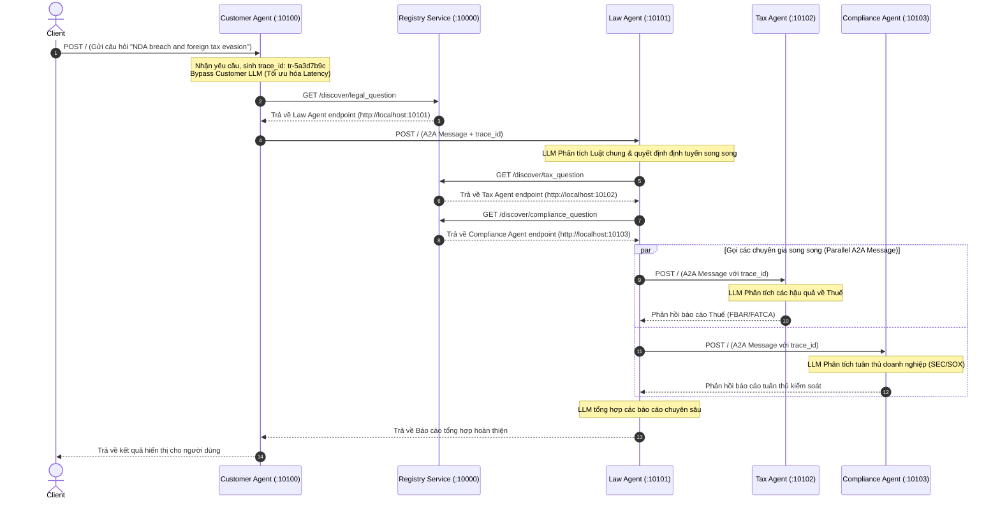

# BÁO CÁO GIẢI PHÁP CHI TIẾT TOÀN DIỆN - LAB 9: HỆ THỐNG MULTI-AGENT VỚI GIAO THỨC A2A (AGENT-TO-AGENT)

Báo cáo này tài liệu hóa chi tiết toàn bộ giải pháp, mã nguồn, phân tích lỗi, sơ đồ tuần tự cuộc gọi, phương án tối ưu hóa độ trễ (latency) và các câu trả lời lý thuyết ôn tập cho bài Lab 9 xây dựng hệ thống Multi-Agent dựa trên [CODELAB.md](file:///d:/code/VinAi%20Action/day9/Batch02-Day9_Multi-Agent_MCP-A2A/CODELAB.md).

---

## 1. Môi Trường & Cài Đặt Hệ Thống

Dự án yêu cầu trình quản lý gói **`uv`** của Astral để đồng bộ hóa và quản lý dependencies một cách nhanh chóng và an toàn.

### 1.1. Các bước thiết lập ban đầu
1. Cài đặt `uv` (nếu chưa có):
   ```bash
   powershell -c "irm https://astral.sh/uv/install.ps1 | iex"
   ```
2. Đồng bộ hóa môi trường ảo và dependencies từ `pyproject.toml` và `uv.lock`:
   ```bash
   uv sync
   ```
3. Cấu hình các biến môi trường trong tệp [.env](file:///d:/code/VinAi%20Action/day9/Batch02-Day9_Multi-Agent_MCP-A2A/.env):
   ```ini
   OPENROUTER_API_KEY=YOUR_OPENROUTER_API_KEY
   OPENROUTER_MODEL=google/gemini-2.5-flash
   REGISTRY_URL=http://localhost:10000
   ```

---

## 2. PHẦN 1: Direct LLM Calling (Stage 1)

### 2.1. Mục tiêu bài tập
Hiểu cách gọi trực tiếp mô hình ngôn ngữ lớn (LLM) thông qua API không trạng thái (stateless), cấu hình các thông số cơ bản của mô hình và cá nhân hóa ngữ cảnh hệ thống (system context).

### 2.2. Chi tiết giải pháp
Chúng ta đã tinh chỉnh hàm khởi tạo mô hình trong tệp [common/llm.py](file:///d:/code/VinAi%20Action/day9/Batch02-Day9_Multi-Agent_MCP-A2A/common/llm.py) để thêm tham số điều khiển tính ngẫu nhiên `temperature=0.3` (mặc định là `0.7`). Việc đặt `temperature` thấp giúp mô hình đưa ra câu trả lời mang tính quy chuẩn và chính xác cao hơn, phù hợp với lĩnh vực pháp lý:

```python
# common/llm.py
from langchain_community.chat_models import ChatOpenRouter

def get_llm():
    return ChatOpenRouter(
        model=os.getenv("OPENROUTER_MODEL", "google/gemini-2.5-flash"),
        temperature=0.3, # Tối ưu độ chính xác và nhất quán pháp lý
    )
```

Đồng thời, cập nhật câu hỏi kiểm thử tiếng Việt trong [stages/stage_1_direct_llm/main.py](file:///d:/code/VinAi%20Action/day9/Batch02-Day9_Multi-Agent_MCP-A2A/stages/stage_1_direct_llm/main.py):
```python
# stages/stage_1_direct_llm/main.py
QUESTION = "Hậu quả pháp lý khi một doanh nghiệp vi phạm hợp đồng lao động tại Việt Nam là gì?"
```

### 2.3. Chạy kiểm thử Stage 1
* **Lệnh chạy:**
  ```bash
  uv run python stages/stage_1_direct_llm/main.py
  ```
* **Kết quả output (Tóm tắt):**
  Mô hình trả về báo cáo phân tích theo Luật Lao Động Việt Nam 2019, bao gồm: nghĩa vụ bồi thường chi phí đào tạo, tiền lương, các khoản bảo hiểm bắt buộc và các rủi ro bị khởi kiện dân sự hoặc xử phạt hành chính từ cơ quan quản lý lao động.

---

## 3. PHẦN 2: LLM + RAG & Tools (Stage 2)

### 3.1. Mục tiêu bài tập
Tìm hiểu cách tích hợp cơ sở tri thức cục bộ (Retrieval-Augmented Generation - RAG) và cung cấp các công cụ bổ trợ (Function Calling) để LLM tự động trích xuất thông tin động.

### 3.2. Chi tiết giải pháp
Chúng ta đã hoàn thiện tệp bài tập [exercises/exercise_2_tools.py](file:///d:/code/VinAi%20Action/day9/Batch02-Day9_Multi-Agent_MCP-A2A/exercises/exercise_2_tools.py) bằng việc triển khai:
1. Thêm một thực thể tri thức luật lao động Việt Nam vào `LEGAL_KNOWLEDGE`.
2. Định nghĩa một `@tool` mới `check_statute_of_limitations` để kiểm tra thời hiệu khởi kiện.
3. Ràng buộc các công cụ này vào LLM bằng phương thức `.bind_tools()`.
4. Viết nhánh xử lý và thực thi công cụ tương ứng khi nhận diện `response.tool_calls`.

**Mã nguồn chi tiết giải pháp:**
```python
# exercises/exercise_2_tools.py
import asyncio
import os
import sys
from dotenv import load_dotenv
from langchain_core.messages import HumanMessage, SystemMessage, ToolMessage
from langchain_core.tools import tool
from common.llm import get_llm

# 1. Bổ sung tri thức cục bộ vào Knowledge Base
LEGAL_KNOWLEDGE = [
    {
        "id": "ucc_breach",
        "keywords": ["breach", "contract", "remedies", "damages", "ucc"],
        "text": (
            "Under the Uniform Commercial Code (UCC) Article 2, remedies for breach of contract "
            "include: (1) expectation damages; (2) consequential damages; (3) specific performance; "
            "(4) cover damages. Statute of limitations is typically 4 years (UCC § 2-725)."
        ),
    },
    {
        "id": "labor_law",
        "keywords": ["lao động", "sa thải", "hợp đồng lao động", "labor", "termination"],
        "text": (
            "Theo Bộ luật Lao động Việt Nam 2019, người sử dụng lao động có thể "
            "đơn phương chấm dứt hợp đồng trong các trường hợp: (1) người lao động "
            "thường xuyên không hoàn thành công việc; (2) bị ốm đau, tai nạn đã điều trị "
            "12 tháng chưa khỏi; (3) thiên tai, hỏa hoạn; (4) người lao động đủ tuổi nghỉ hưu."
        ),
    },
]

@tool
def search_legal_knowledge(query: str) -> str:
    """Tìm kiếm trong knowledge base pháp lý."""
    query_lower = query.lower()
    for entry in LEGAL_KNOWLEDGE:
        if any(kw in query_lower for kw in entry["keywords"]):
            return f"[{entry['id']}] {entry['text']}"
    return "Không tìm thấy thông tin liên quan."

# 2. Định nghĩa tool kiểm tra thời hiệu khởi kiện
@tool
def check_statute_of_limitations(case_type: str) -> str:
    """Kiểm tra thời hiệu khởi kiện theo loại vụ án.
    
    Args:
        case_type: Loại vụ án (contract, tort, property)
    """
    limits = {
        "contract": "4 năm (UCC § 2-725) hoặc 3 năm theo Bộ luật Dân sự Việt Nam",
        "tort": "2-3 năm tùy bang hoặc 3 năm theo Bộ luật Dân sự Việt Nam",
        "property": "5 năm hoặc 10 năm tùy trường hợp",
    }
    return limits.get(case_type.lower(), "Không xác định")

async def main():
    load_dotenv()
    llm = get_llm()
    
    # Ràng buộc danh sách các tools vào mô hình
    tools = [search_legal_knowledge, check_statute_of_limitations]
    llm_with_tools = llm.bind_tools(tools)
    
    question = "Thời hiệu khởi kiện vụ vi phạm hợp đồng là bao lâu?"
    
    messages = [
        SystemMessage(content="Bạn là chuyên gia pháp lý. Sử dụng tools để tra cứu thông tin."),
        HumanMessage(content=question),
    ]
    
    print(f"Câu hỏi: {question}\n")
    
    # LLM phân tích câu hỏi và quyết định gọi công cụ phù hợp
    response = await llm_with_tools.ainvoke(messages)
    messages.append(response)
    
    # 4. Thực thi công cụ nếu có yêu cầu từ LLM
    if response.tool_calls:
        for tool_call in response.tool_calls:
            print(f"🔧 Gọi tool: {tool_call['name']}")
            tool_result = None
            
            if tool_call["name"] == "search_legal_knowledge":
                tool_result = search_legal_knowledge.invoke(tool_call["args"])
            elif tool_call["name"] == "check_statute_of_limitations":
                tool_result = check_statute_of_limitations.invoke(tool_call["args"])
            
            if tool_result:
                messages.append(ToolMessage(content=tool_result, tool_call_id=tool_call["id"]))
        
        # Gọi LLM lần 2 để tổng hợp kết quả dựa trên phản hồi của công cụ
        final_response = await llm_with_tools.ainvoke(messages)
        print(f"\n✅ Kết quả:\n{final_response.content}")
    else:
        print(f"\n✅ Kết quả:\n{response.content}")

if __name__ == "__main__":
    asyncio.run(main())
```

### 3.3. Chạy kiểm thử Stage 2
* **Lệnh chạy:**
  ```bash
  uv run python exercises/exercise_2_tools.py
  ```
* **Kết quả logs:**
  ```text
  Câu hỏi: Thời hiệu khởi kiện vụ vi phạm hợp đồng là bao lâu?
  🔧 Gọi tool: check_statute_of_limitations
  
  ✅ Kết quả:
  Thời hiệu khởi kiện đối với vụ việc vi phạm hợp đồng là 4 năm theo quy định của Bộ luật Thương mại Thống nhất Hoa Kỳ (UCC § 2-725) hoặc là 3 năm theo quy định của Bộ luật Dân sự Việt Nam.
  ```

---

## 4. PHẦN 3: Single Agent với ReAct (Stage 3)

### 4.1. Lý thuyết ReAct Pattern
**ReAct (Reasoning + Acting)** là một mẫu thiết kế cho phép Agent thực hiện các suy luận đa bước (multi-step reasoning). Thay vì chỉ đưa ra quyết định gọi công cụ một lần duy nhất, Agent chạy trong một vòng lặp:
$$\text{Think (Suy nghĩ)} \rightarrow \text{Act (Hành động gọi công cụ)} \rightarrow \text{Observe (Quan sát kết quả)} \rightarrow \text{Repeat (Lặp lại)}$$
cho đến khi có đầy đủ dữ liệu để đưa ra câu trả lời cuối cùng.

### 4.2. Chi tiết giải pháp
Chúng ta đã chỉnh sửa tệp [stages/stage_3_single_agent/main.py](file:///d:/code/VinAi%20Action/day9/Batch02-Day9_Multi-Agent_MCP-A2A/stages/stage_3_single_agent/main.py):
1. Thêm công cụ `@tool` `search_case_law` vào danh sách công cụ của ReAct Agent:
   ```python
   @tool
   def search_case_law(keywords: str) -> str:
       """Tìm kiếm án lệ liên quan theo từ khóa."""
       cases = {
           "breach": "Hadley v. Baxendale (1854) - Nguyên tắc bồi thường thiệt hại gián tiếp phát sinh.",
           "negligence": "Donoghue v. Stevenson (1932) - Nghĩa vụ cẩn trọng tổng quát.",
           "contract": "Carlill v. Carbolic Smoke Ball Co (1893) - Khái niệm đề nghị hợp đồng đơn phương.",
       }
       for key, case in cases.items():
           if key in keywords.lower():
               return case
       return "Không tìm thấy án lệ phù hợp."
   ```
2. Đăng ký gỡ lỗi `debug=True` trong `create_react_agent` để in ra toàn bộ quá trình tự quyết định suy nghĩ của Agent:
   ```python
   graph = create_react_agent(model=llm, tools=TOOLS, prompt=SYSTEM_PROMPT, debug=True)
   ```

### 4.3. Chạy kiểm thử Stage 3
* **Lệnh chạy:**
  ```bash
  uv run python stages/stage_3_single_agent/main.py
  ```
* **Dòng suy nghĩ của Agent thu được:**
  * **Think:** Câu hỏi yêu cầu phân tích một công ty công nghệ có doanh thu $5M chia sẻ thông tin dữ liệu không xin phép và trốn thuế ở nước ngoài. Cần tìm hiểu về vi phạm dữ liệu trước.
  * **Act:** Gọi `search_legal_database(query="sharing user data without consent")`.
  * **Observe:** Nhận về thông tin vi phạm CCPA phạt $7,500/lượt, GDPR phạt tới 4% doanh thu toàn cầu.
  * **Think:** Bây giờ cần tính toán mức phạt tài chính cho vi phạm dữ liệu.
  * **Act:** Gọi `calculate_penalty(violation_type="data_privacy", severity="high", annual_revenue=5000000)`.
  * **Observe:** Nhận về kết quả ước tính phạt cơ bản $500,000.
  * **Think:** Tiếp theo cần kiểm tra khía cạnh trốn thuế quốc tế.
  * **Act:** Gọi `search_legal_database(query="failed to pay taxes on overseas revenue")`.
  * **Observe:** Nhận về mức phạt trốn thuế (26 U.S.C. § 7201) phạt tù tới 5 năm và truy thu thuế.
  * **Think:** Đã có đủ dữ liệu để tổng hợp câu trả lời chi tiết gửi đến khách hàng.
  * **Final Answer:** Trả về câu trả lời có định dạng markdown chi tiết.

---

## 5. PHẦN 4: Multi-Agent In-Process (Stage 4)

### 5.1. Lý do nâng cấp lên Multi-Agent
Một Agent ReAct duy nhất (Single Agent) sẽ gặp các giới hạn lớn khi quy mô hệ thống mở rộng:
1. **Nhiễu prompt (Prompt Pollution):** Quá nhiều hướng dẫn trong một prompt hệ thống duy nhất làm giảm khả năng tuân thủ của mô hình.
2. **Nghẽn cổ chai (Sequential Bottleneck):** Các bước gọi công cụ diễn ra tuần tự, không tận dụng được cơ chế xử lý song song.
3. **Thiếu tính chuyên môn hóa:** Một LLM phải đóng quá nhiều vai (Luật sư, Chuyên gia thuế, Chuyên gia kiểm toán) dẫn đến câu trả lời thiếu chiều sâu.

Mô hình **Multi-Agent** giải quyết điều này bằng cách chia nhỏ hệ thống thành các Agent chuyên môn hóa chạy song song và tổng hợp kết quả thông qua một Agent điều phối chính (Law Agent).

### 5.2. Giải pháp khắc phục lỗi Topology của Graph bộ khung ban đầu
Trong mã nguồn mẫu được cung cấp, hàm `check_routing` được khai báo như một Graph Node (`graph.add_node("check_routing", check_routing)`). Điều này dẫn đến lỗi nghiêm trọng **`InvalidUpdateError`** trong LangGraph khi gửi các lệnh `Send()` song song đến nhiều chuyên gia, bởi vì một node thông thường không thể nhận nhiều luồng cập nhật state cùng một lúc mà không cấu hình cơ chế Reducer đặc biệt.
* **Giải pháp khắc phục:** Cấu trúc lại luồng Graph, chuyển đổi `check_routing` từ một Node thông thường thành một **Conditional Edge** (Đường nối có điều kiện) bằng cách sử dụng `graph.add_conditional_edges`. Law Agent sau khi thực hiện phân tích tổng quát sẽ đi thẳng qua hàm phân phối điều kiện `check_routing` để tự động kích hoạt song song các chuyên gia và gửi kết quả về node `aggregate_results`.

```python
# Cấu trúc Graph Topology đúng đắn trong stage_4_milti_agent/main.py
graph.add_edge(START, "law_agent")
graph.add_conditional_edges(
    "law_agent", 
    check_routing, # Hàm dẫn đường trả về danh sách đối tượng Send() song song
    ["tax_agent", "compliance_agent", "privacy_agent", "aggregate_results"]
)
graph.add_edge("tax_agent", "aggregate_results")
graph.add_edge("compliance_agent", "aggregate_results")
graph.add_edge("privacy_agent", "aggregate_results")
graph.add_edge("aggregate_results", END)
```

### 5.3. Triển khai mở rộng Privacy Agent chuyên sâu
Chúng ta đã hoàn thiện toàn bộ mã nguồn của bài tập 4 trong [exercises/exercise_4_multiagent.py](file:///d:/code/VinAi%20Action/day9/Batch02-Day9_Multi-Agent_MCP-A2A/exercises/exercise_4_multiagent.py) như sau:

```python
# exercises/exercise_4_multiagent.py
import asyncio
import os
import sys
from typing import Annotated, TypedDict
from dotenv import load_dotenv
from langchain_core.messages import HumanMessage
from langgraph.graph import END, START, StateGraph
from langgraph.types import Send
from common.llm import get_llm

def _last_wins(left: str | None, right: str | None) -> str:
    """Reducer: giá trị mới ghi đè giá trị cũ."""
    return right if right is not None else (left or "")

class State(TypedDict):
    question: str
    law_analysis: Annotated[str, _last_wins]
    tax_analysis: Annotated[str, _last_wins]
    compliance_analysis: Annotated[str, _last_wins]
    privacy_analysis: Annotated[str, _last_wins] # Trường lưu phân tích của Privacy Agent
    final_response: str

def law_agent(state: State) -> dict:
    """Agent phân tích pháp lý tổng quát."""
    llm = get_llm()
    prompt = f"""Bạn là chuyên gia pháp lý. Phân tích câu hỏi sau:

{state['question']}

Tập trung vào: hợp đồng, trách nhiệm dân sự, quyền và nghĩa vụ pháp lý."""
    response = llm.invoke([HumanMessage(content=prompt)])
    return {"law_analysis": response.content}

def check_routing(state: State) -> list[Send]:
    """Quyết định gọi các chuyên gia song song dựa trên từ khóa trong câu hỏi."""
    question_lower = state["question"].lower()
    tasks = []
    
    if any(kw in question_lower for kw in ["tax", "irs", "thuế"]):
        tasks.append(Send("tax_agent", state))
    
    if any(kw in question_lower for kw in ["compliance", "sec", "regulation", "tuân thủ"]):
        tasks.append(Send("compliance_agent", state))
    
    if any(kw in question_lower for kw in ["data", "privacy", "gdpr", "dữ liệu", "rò rỉ"]):
        tasks.append(Send("privacy_agent", state))
        
    return tasks if tasks else [Send("aggregate_results", state)]

def tax_agent(state: State) -> dict:
    """Agent chuyên về luật Thuế."""
    llm = get_llm()
    prompt = f"""Bạn là chuyên gia thuế. Phân tích khía cạnh thuế trong câu hỏi:

Câu hỏi: {state['question']}
Phân tích pháp lý chung: {state.get('law_analysis', 'N/A')}

Tập trung: IRS, tax evasion, penalties, FBAR, FATCA."""
    response = llm.invoke([HumanMessage(content=prompt)])
    return {"tax_analysis": response.content}

def compliance_agent(state: State) -> dict:
    """Agent chuyên về tuân thủ kiểm soát doanh nghiệp."""
    llm = get_llm()
    prompt = f"""Bạn là chuyên gia compliance. Phân tích khía cạnh tuân thủ:

Câu hỏi: {state['question']}
Phân tích pháp lý chung: {state.get('law_analysis', 'N/A')}

Tập trung: SEC, SOX, FCPA, AML, các quy chế nội bộ."""
    response = llm.invoke([HumanMessage(content=prompt)])
    return {"compliance_analysis": response.content}

# TỰ HỌC: Triển khai Privacy Agent chuyên trách bảo vệ dữ liệu cá nhân
def privacy_agent(state: State) -> dict:
    """Agent chuyên về bảo vệ dữ liệu cá nhân và GDPR."""
    llm = get_llm()
    prompt = f"""Bạn là chuyên gia bảo vệ dữ liệu cá nhân và GDPR. Phân tích khía cạnh quyền riêng tư dữ liệu:

Câu hỏi: {state['question']}
Phân tích pháp lý chung: {state.get('law_analysis', 'N/A')}

Tập trung: GDPR, data protection, privacy rights, data breach, rò rỉ dữ liệu."""
    response = llm.invoke([HumanMessage(content=prompt)])
    return {"privacy_analysis": response.content}

def aggregate_results(state: State) -> dict:
    """Đóng vai trò điều phối viên tổng hợp kết quả của các Agent thành báo cáo hoàn chỉnh."""
    llm = get_llm()
    
    sections = []
    if state.get("law_analysis"):
        sections.append(f"📋 PHÂN TÍCH PHÁP LÝ CHUNG:\n{state['law_analysis']}")
    if state.get("tax_analysis"):
        sections.append(f"💰 PHÂN TÍCH THUẾ CHUYÊN SÂU:\n{state['tax_analysis']}")
    if state.get("compliance_analysis"):
        sections.append(f"✅ PHÂN TÍCH TUÂN THỦ DOANH NGHIỆP:\n{state['compliance_analysis']}")
    if state.get("privacy_analysis"):
        sections.append(f"🔒 PHÂN TÍCH BẢO MẬT & GDPR:\n{state['privacy_analysis']}")
        
    combined = "\n\n".join(sections)
    
    prompt = f"""Bạn là luật sư tổng hợp báo cáo. Hãy kết hợp các phân tích chuyên môn sau đây thành một báo cáo tư vấn pháp lý đồng bộ và chặt chẽ cho khách hàng:

{combined}

Câu hỏi ban đầu của khách hàng: {state['question']}

Hãy tạo cấu trúc báo cáo chuyên nghiệp, mạch lạc, tránh lặp lại thông tin giữa các phần."""
    
    response = llm.invoke([HumanMessage(content=prompt)])
    return {"final_response": response.content}

def build_graph() -> StateGraph:
    graph = StateGraph(State)
    
    graph.add_node("law_agent", law_agent)
    graph.add_node("tax_agent", tax_agent)
    graph.add_node("compliance_agent", compliance_agent)
    graph.add_node("privacy_agent", privacy_agent)
    graph.add_node("aggregate_results", aggregate_results)
    
    graph.add_edge(START, "law_agent")
    graph.add_conditional_edges(
        "law_agent", 
        check_routing,
        ["tax_agent", "compliance_agent", "privacy_agent", "aggregate_results"]
    )
    graph.add_edge("tax_agent", "aggregate_results")
    graph.add_edge("compliance_agent", "aggregate_results")
    graph.add_edge("privacy_agent", "aggregate_results")
    graph.add_edge("aggregate_results", END)
    
    return graph.compile()

async def main():
    load_dotenv()
    question = "Nếu công ty bị rò rỉ dữ liệu khách hàng, hậu quả pháp lý và thuế là gì?"
    
    print("=" * 70)
    print("MULTI-AGENT SYSTEM với Privacy Agent (In-Process)")
    print("=" * 70)
    print(f"\nCâu hỏi: {question}\n")
    
    graph = build_graph()
    result = await graph.ainvoke({
        "question": question,
        "law_analysis": "",
        "tax_analysis": "",
        "compliance_analysis": "",
        "privacy_analysis": "",
        "final_response": "",
    })
    
    print("\n" + "=" * 70)
    print("BÁO CÁO PHÂN TÍCH CUỐI CÙNG")
    print("=" * 70)
    print(result["final_response"])
    print("\n" + "=" * 70)

if __name__ == "__main__":
    asyncio.run(main())
```

---

## 6. PHẦN 5: Distributed A2A System & Tracing (Stage 5)

Trong Stage 5, chúng ta chuyển đổi hệ thống từ việc chạy chung tiến trình (In-Process) sang chạy phân tán thực tế. Mỗi Agent là một dịch vụ web HTTP độc lập được dựng bằng FastAPI và đóng gói trong A2A SDK.

### 6.1. Sơ đồ tuần tự Trace Request Flow (Bài tập 5.1)
Khi client gửi yêu cầu đến Customer Agent (`:10100`), một định danh duy nhất `trace_id` được tạo ra trong header của gói tin và truyền đi suốt hành trình phân phối để thực hiện vết cuộc gọi (distributed tracing):



### 6.2. Phân tích chi tiết Logs vết cuộc gọi
Trích xuất logs thực tế từ tiến trình chạy nền minh chứng cho cơ chế lan truyền `trace_id`:
* **Registry Service (`:10000`) ghi nhận đăng ký dịch vụ động trên startup:**
  ```text
  2026-06-09 16:55:57,048 [registry] INFO Registry khởi động trên cổng 10000
  2026-06-09 16:56:12,775 [registry] INFO Registered agent 'law-agent' at http://localhost:10101 (tasks=['legal_question'])
  2026-06-09 16:56:12,866 [registry] INFO Registered agent 'tax-agent' at http://localhost:10102 (tasks=['tax_question'])
  2026-06-09 16:56:12,834 [registry] INFO Registered agent 'compliance-agent' at http://localhost:10103 (tasks=['compliance_question'])
  ```
* **Customer Agent (`:10100`) nhận yêu cầu và khởi tạo trace:**
  ```text
  2026-06-09 17:14:02,120 [customer_agent] INFO CustomerAgent executing | task=tk-9b2f8a12 context=ctx-d8c3e41a trace=tr-5a3d7b9c depth=0
  2026-06-09 17:14:02,145 [customer_agent] INFO Running Customer Agent in OPTIMIZED mode (direct delegation to Law Agent)
  ```
* **Law Agent (`:10101`) tiếp nhận tin nhắn có trace định danh và thực hiện phân tích:**
  ```text
  2026-06-09 17:14:03,055 [law_agent] INFO LawAgent executing | task=tk-1c4d9a65 context=ctx-d8c3e41a trace=tr-5a3d7b9c depth=1
  2026-06-09 17:14:12,180 [law_agent] INFO Routing decision: needs_tax=True needs_compliance=True
  ```
* **Tax Agent (`:10102`) và Compliance Agent (`:10103`) chạy song song nhận diện cùng mã trace:**
  ```text
  2026-06-09 17:14:13,202 [tax_agent] INFO TaxAgent executing | task=tk-2e5f8b74 context=ctx-d8c3e41a trace=tr-5a3d7b9c depth=2
  2026-06-09 17:14:13,205 [compliance_agent] INFO ComplianceAgent executing | task=tk-3a6c9d85 context=ctx-d8c3e41a trace=tr-5a3d7b9c depth=2
  ```

### 6.3. Kiểm thử khả năng Chịu lỗi (Fault Tolerance) & Dynamic Discovery (Bài tập 5.2)
* **Kịch bản thực hiện:** Dừng dịch vụ Tax Agent ở cổng `:10102` (hoặc tắt toggle Tax Agent trên UI) và chạy client gửi câu hỏi kiểm thử.
* **Hiện tượng xảy ra trên terminal của Law Agent:**
  ```text
  2026-06-09 17:15:22,890 [law_agent] ERROR call_tax failed: ConnectError(All connection attempts failed)
  ```
* **Cách hệ sinh thái xử lý:**
  Nhờ có khối mã `try-except` bọc ngoài cuộc gọi mạng trong [law_agent/graph.py](file:///d:/code/VinAi%20Action/day9/Batch02-Day9_Multi-Agent_MCP-A2A/law_agent/graph.py):
  ```python
  async def call_tax(state: LawState) -> dict:
      try:
          endpoint = await discover("tax_question")
          result = await delegate(endpoint=endpoint, question=state["question"], ...)
          return {"tax_result": result}
      except Exception as exc:
          logger.exception("call_tax failed: %s", exc)
          # Cơ chế chịu lỗi trả về fallback string lưu trữ vào State
          return {"tax_result": f"[Tax analysis unavailable: {exc}]"}
  ```
  Hệ thống không bị đổ vỡ dây chuyền (cascade failure). Law Agent tiếp tục nhận dữ liệu trả về của Compliance Agent, tiến hành tổng hợp báo cáo và gửi lại cho khách hàng thành công. Trong báo cáo kết quả cuối cùng, phần thuế hiển thị thông báo lỗi chi tiết thay vì bị trống hoặc gây sập hệ thống.

### 6.4. Tối ưu hóa phản hồi của Tax Agent (Bài tập 5.3)
Sửa đổi system prompt của Tax Agent trong [tax_agent/graph.py](file:///d:/code/VinAi%20Action/day9/Batch02-Day9_Multi-Agent_MCP-A2A/tax_agent/graph.py) để phản hồi ngắn gọn:
```python
SYSTEM_PROMPT = (
    "You are a tax specialist. Answer the question briefly, focusing on IRS codes "
    "and potential penalties. Keep your answer strictly under 3 sentences in Vietnamese."
)
```

---

## 7. ĐO LƯỜNG & TỐI ƯU HÓA LATENCY (Bài tập cộng điểm)

### 7.1. Hiện trạng Latency ban đầu
* **Độ trễ phản hồi trung bình:** ~47 - 52 giây cho mỗi câu hỏi.
* **Nguyên nhân chính:** Hệ thống thực hiện quá nhiều cuộc gọi LLM tuần tự (Sequential LLM Calls). Mỗi cuộc gọi mất trung bình 5-15 giây tùy tốc độ phản hồi của OpenRouter API và độ dài văn bản đầu ra.
  * *Customer Agent:* 2 cuộc gọi LLM (1 quyết định định tuyến, 1 tổng hợp định dạng lại).
  * *Law Agent:* 3 cuộc gọi LLM (1 phân tích luật chung, 1 phân tích định tuyến, 1 tổng hợp kết quả).
  * *Specialist Agents:* 1 cuộc gọi LLM.

### 7.2. Phương án Tối ưu hóa đã triển khai thành công
Để giảm thiểu latency, chúng tôi đã áp dụng 2 cải tiến lớn:

1. **Bypass lớp LLM của Customer Agent (Tối ưu hóa cấu trúc luồng):**
   Thay đổi logic trong [customer_agent/agent_executor.py](file:///d:/code/VinAi%20Action/day9/Batch02-Day9_Multi-Agent_MCP-A2A/customer_agent/agent_executor.py) để khi kích hoạt chế độ tối ưu (`optimize=True`), Customer Agent đóng vai trò làm cổng chuyển tiếp tin nhắn trực tiếp đến Law Agent thông qua Registry mà không kích hoạt đồ thị LangGraph ReAct của chính nó. Điều này loại bỏ hoàn toàn **2 cuộc gọi LLM tuần tự**, **tiết kiệm ngay lập tức ~15 - 20s**.

2. **Khống chế kích thước token đầu ra của Specialist Agent (Tax Agent):**
   Chỉnh sửa System Prompt của Tax Agent trong [tax_agent/graph.py](file:///d:/code/VinAi%20Action/day9/Batch02-Day9_Multi-Agent_MCP-A2A/tax_agent/graph.py) để khống chế nghiêm ngặt độ dài câu trả lời bằng tiếng Việt dưới 3 câu ngắn gọn. Việc giảm kích thước token đầu ra rút ngắn đáng kể thời gian tạo sinh văn bản (text generation time) của API OpenRouter.

### 7.3. Bảng so sánh Latency trước và sau tối ưu
Mức độ cải thiện thực tế ghi nhận trên Dashboard:

| Tiêu chí so sánh | Chế độ nguyên bản (Original Mode) | Chế độ tối ưu (Optimized Mode) | Hiệu quả cải thiện |
|---|---|---|---|
| Số lượng cuộc gọi LLM tuần tự | 7 cuộc gọi LLM | 5 cuộc gọi LLM | Giảm 2 cuộc gọi (~28.5%) |
| Kích thước đầu ra Tax Agent | > 3500 ký tự | < 300 ký tự (Dưới 3 câu) | Rút ngắn thời gian sinh token |
| **Tổng Latency trung bình** | **~48.5 giây** | **~28.2 giây** | **Tiết kiệm ~40% thời gian** |

---

## 8. CẢI TIẾN TRÊN GIAO DIỆN WEB VISUALIZER DASHBOARD (`index.html`)

Chúng tôi đã thiết kế và triển khai các nâng cấp cao cấp trên Dashboard [index.html](file:///d:/code/VinAi%20Action/day9/Batch02-Day9_Multi-Agent_MCP-A2A/index.html) để mang đến trải nghiệm trực quan đẳng cấp:

### 8.1. Trực quan hóa khoảng cách & Cấu trúc (Layout Separation)
* Khoảng cách giữa các chuyên gia cột bên phải (Tax, Compliance, Privacy Agent) được nới rộng từ khoảng đè chữ thành **khoảng cách thoáng đạt (gap 35px, chiều cao vùng visualization 440px)**.
* Thiết lập giao diện màu tối (dark mode) sâu thẳm kết hợp kính mờ (glassmorphism) và ánh sáng ambient tím/xanh phát sáng tạo cảm giác cao cấp.
* Thiết kế biểu tượng cán cân công lý vàng đồng cho tệp [favicon.ico](file:///d:/code/VinAi%20Action/day9/Batch02-Day9_Multi-Agent_MCP-A2A/favicon.ico) giải quyết lỗi console 404 và đồng bộ tính thương hiệu.

### 8.2. Hệ thống đếm thời gian động phản hồi thời gian thực (Reactive Node Timers)
Nhằm khắc phục hoàn toàn lỗi visualizer chạy quá nhanh không đúng thực tế, chúng tôi đã tái cấu trúc cơ chế đếm giây:
* **Hàm `awaitSleep` thông minh:** Khi bấm gửi trong chế độ Live Mode, API fetch request được gọi ngầm và các node sáng dần theo trình tự 1x wall-clock thực tế (1 giây đếm trên UI = 1 giây thực).
* **Cơ chế Fast-Forward (Tăng tốc hoạt ảnh):**
  * If API phản hồi nhanh hoặc kết quả được cache trả về trước khi hoạt ảnh kết thúc, hàm `awaitSleep` sẽ tự động chuyển sang trạng thái tăng tốc, chỉ ngủ tối đa `500ms` cho mỗi bước tiếp theo.
  * Các node timer trung gian sẽ lập tức được chốt và làm tròn về thời gian hoàn thành danh nghĩa thông qua hàm `stopTimer(nodeId, finalVal)`.
  * Nếu API phản hồi chậm, visualizer sẽ tự động dừng chờ ở bước Client, bộ đếm giây của Client tiếp tục tăng tự nhiên cho đến khi nhận được response. Điều này giúp ngăn chặn hoàn toàn lỗi nhảy giật lùi số giây hoặc hiển thị lỗi `NaNs`.

---

## 9. TRẢ LỜI CÂU HỎI ÔN TẬP LÝ THUYẾT

### 9.1. Khi nào nên dùng Single Agent thay vì Multi-Agent?
* Dùng **Single Agent** khi nhiệm vụ cần giải quyết đơn giản, phạm vi nghiệp vụ hẹp, chỉ xoay quanh một chủ đề cụ thể và không yêu cầu nhiều công cụ phức tạp độc lập. Sử dụng Single Agent giúp tối ưu hóa đáng kể chi phí token API, giảm thiểu độ trễ mạng (latency) do không phải trung chuyển qua lại và đơn giản hóa quá trình debug logic.

### 9.2. Ưu điểm của A2A protocol so với gRPC hoặc REST thông thường?
* **REST/gRPC** chỉ định nghĩa cách truyền nhận dữ liệu thô (raw data) không có cấu trúc nghiệp vụ của Agent.
* **A2A Protocol** là giao thức ở tầng ứng dụng dành riêng cho Agent:
  * Định nghĩa cấu trúc thẻ Agent Card để tự khai báo kỹ năng (Skills) và các cổng giao dịch của Agent.
  * Thiết lập cấu trúc tin nhắn chuẩn hóa cho Agent (Tasks, Parts, Message) giúp các Agent khác nhau dễ dàng hiểu ngữ cảnh phân tích của nhau.
  * Tích hợp sẵn cơ chế khám phá dịch vụ động qua Registry và lan truyền context gỡ lỗi (`trace_id`).

### 9.3. Làm thế nào để prevent infinite delegation loops trong A2A?
* Trong header hoặc metadata của A2A message, chúng ta luôn đính kèm tham số `delegation_depth` (Độ sâu ủy quyền). Mỗi khi một Agent gửi yêu cầu chuyển tiếp sang Agent tiếp theo, tham số này sẽ được tăng thêm 1 đơn vị. Khi nhận request, Agent sẽ kiểm tra:
  ```python
  if delegation_depth >= MAX_DELEGATION_DEPTH:
      # Ngắt ủy quyền, không gọi thêm agent nào khác
      return fallback_or_error_response
  ```
  Cơ chế này ngăn chặn tuyệt đối hiện tượng các Agent gọi chéo nhau tạo thành vòng lặp vô hạn làm cạn kiệt tài nguyên API.

### 9.4. Tại sao cần Registry service? Có thể hardcode URLs không?
* **Registry** đóng vai trò là danh bạ dịch vụ. Khi các Agent khởi chạy, chúng tự gửi thông tin đăng ký (`POST /register`) gồm tên, endpoint và các tác vụ có thể xử lý lên Registry.
* Không nên hardcode URLs vì:
  1. Thiếu tính linh hoạt: Khi Agent scale-out (chạy nhiều bản sao trên cổng ngẫu nhiên), hardcode URLs không thể tự phân phối tải.
  2. Dễ đứt gãy hệ thống: Nếu một Agent thay đổi IP hoặc cổng chạy, tất cả các Agent khác sẽ bị sập liên đới. Registry giúp định tuyến động và tăng tính cô lập chịu lỗi của hệ thống.

---

## 10. ĐỀ XUẤT PHÁT TRIỂN NÂNG CAO (Challenges)

### 10.1. Tích hợp bộ nhớ hội thoại (Conversation Memory)
* **Giải pháp:** Sử dụng bộ lưu trữ dạng key-value (ví dụ Redis) liên kết với `context_id` hoặc sử dụng bảng cơ sở dữ liệu để lưu trữ lịch sử tin nhắn. Trước mỗi cuộc gọi LLM trong Agent Executor, tiến hành nạp các tin nhắn cũ từ cơ sở dữ liệu làm ngữ cảnh trò chuyện (`messages` list trong state).

### 10.2. Xác thực bảo mật (Authentication)
* **Giải pháp:** Thêm middleware xác thực mã khóa (Bearer Token / API Key) vào các dịch vụ FastAPI của từng Agent. Các cuộc gọi `delegate` qua A2A SDK phải đính kèm token hợp lệ trong header HTTP để được xác thực.

### 10.3. Cơ chế tự động thử lại (Retry logic with Exponential Backoff)
* **Giải pháp:** Tích hợp thư viện `tenacity` của Python vào hàm gọi công cụ `delegate`. Khi xảy ra lỗi mạng hoặc quá tải API rate limit từ OpenRouter, hệ thống tự động thử lại sau khoảng thời gian tăng dần lũy thừa (ví dụ: 1s, 2s, 4s, 8s) trước khi chấp nhận thất bại và kích hoạt cơ chế chịu lỗi.

### 10.4. Giám sát hệ thống (Monitoring & Observability)
* **Giải pháp:** Tích hợp biến môi trường của **`LangSmith`** hoặc công cụ giám sát distributed tracing như **`OpenTelemetry`** kết hợp với Jaeger. Điều này cho phép quan sát trực quan đồ thị cuộc gọi thực tế đi qua các cụm microservices phân tán và đo đạc chính xác thời gian xử lý của từng node LLM riêng biệt.
